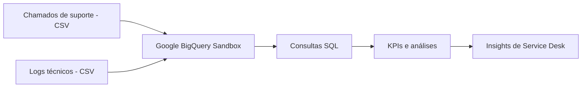

# Análise de Chamados de Suporte Técnico com Google BigQuery

Projeto de portfólio que simula uma operação de **Service Desk**, integrando duas fontes de dados fictícias — chamados de suporte e logs técnicos — para analisar SLA, tempo de resolução, reincidência, satisfação do usuário e comportamento dos sistemas.

> **Importante:** todos os dados são sintéticos e foram criados exclusivamente para estudo e portfólio. Nenhuma informação de empresa ou cliente real é utilizada.

## Objetivo

O projeto foi desenvolvido para praticar conceitos de **Big Data, armazenamento e análise de dados em nuvem**, aplicando-os a um cenário próximo de uma operação real de Suporte Técnico.

A proposta foi trabalhar com múltiplas fontes de dados, organizar os dados no Google BigQuery, utilizar SQL para análise operacional, acompanhar indicadores de Service Desk, relacionar eventos técnicos com chamados e transformar resultados em insights de melhoria contínua.

## Arquitetura



Nesta implementação, os arquivos CSV foram carregados diretamente no **BigQuery Sandbox**, permitindo executar o projeto sem ativar faturamento no Google Cloud.

## Fontes de dados

Os dados podem ser reproduzidos executando [`scripts/gerar_dados.py`](scripts/gerar_dados.py).

### Chamados de suporte

O script gera **200 chamados fictícios** com categoria, assunto, prioridade, canal, nível de atendimento, status, SLA, tempo de resolução, reincidência e CSAT.

### Logs técnicos

Também são gerados **300 eventos fictícios** contendo sistema, severidade, tipo de evento, mensagem, origem, status e vínculo com chamado quando aplicável. Parte dos eventos possui um `id_chamado`, permitindo integrar as duas fontes com `JOIN`.

## Tecnologias utilizadas

- **Google BigQuery Sandbox**
- **SQL**
- **Python** para geração dos dados sintéticos
- **CSV**
- **GitHub**
- Conceitos de **Service Desk / ITSM**

## Análises realizadas

As consultas estão disponíveis em [`sql/analises_suporte_bigquery.sql`](sql/analises_suporte_bigquery.sql) e incluem volume por categoria e prioridade, SLA, tempo médio de resolução, reincidência, relação entre SLA e CSAT, análise de logs, `JOIN` entre fontes e resumo executivo de KPIs.

> Para reproduzir as consultas em outro projeto do BigQuery, substitua o ID `data-lake-suporte-jessica` pelo ID do seu próprio projeto.

## Principais indicadores

| Indicador | Resultado |
|---|---:|
| Total de chamados | 200 |
| Chamados finalizados | 161 |
| Cumprimento de SLA | 78,3% |
| Tempo médio de resolução | 8,0 h |
| CSAT médio | 4,09 / 5 |
| Reincidência | 12% |


## Principais insights

### 1. Distribuição dos chamados

A categoria **Banco de Dados** concentrou o maior volume, com **48 ocorrências (24%)**. Apesar disso, a distribuição entre as categorias permaneceu relativamente equilibrada.


### 2. SLA e satisfação

Chamados atendidos **dentro do SLA** apresentaram CSAT médio de **4,26**, enquanto os chamados **fora do SLA** tiveram média de **3,49**. Nesta base simulada, o resultado mostra uma associação entre cumprimento do prazo e maior satisfação do usuário.


### 3. Reincidência

A categoria **Sistema** apresentou a maior taxa de reincidência, com **22,5%**. Em uma operação real, esse resultado justificaria investigação de causa raiz e ações preventivas.


### 4. Integração de logs e chamados

Foi realizado um `JOIN` entre logs técnicos e chamados de suporte, permitindo relacionar eventos de sistemas com tempo de resolução e satisfação. O **Banco Oracle** concentrou o maior número de logs vinculados, enquanto o **Servidor de Impressão** apresentou o maior tempo médio de resolução.


## Estrutura do repositório

```text
data-lake-suporte-tecnico/
├── README.md
├── imagens/
│   ├── 01_chamados_por_categoria.jpg
│   ├── 02_kpis_gerais.jpg
│   ├── 03_sla_vs_csat.jpg
│   ├── 04_reincidencia_por_categoria.jpg
│   └── 05_join_logs_chamados.jpg
├── scripts/
│   └── gerar_dados.py
└── sql/
    └── analises_suporte_bigquery.sql
```

## Como reproduzir

1. Clone ou baixe este repositório.
2. Execute `python scripts/gerar_dados.py`.
3. O script criará localmente `dados/chamados_suporte.csv` e `dados/logs_sistema.csv`.
4. Acesse o **Google BigQuery Sandbox** e crie um dataset.
5. Faça upload dos dois CSVs e crie as tabelas `chamados_suporte` e `logs_sistema`.
6. Ajuste o ID do projeto nas consultas SQL, se necessário.
7. Execute as consultas de [`sql/analises_suporte_bigquery.sql`](sql/analises_suporte_bigquery.sql).

## Competências praticadas

- SQL aplicado à análise de dados;
- agregações com `COUNT`, `AVG` e `COUNTIF`;
- cálculo de indicadores com `SAFE_DIVIDE`;
- integração de fontes com `JOIN`;
- análise de SLA, CSAT, reincidência e tempo de resolução;
- interpretação de indicadores de Service Desk;
- análise de logs técnicos;
- geração de dados sintéticos com Python;
- documentação técnica;
- análise de dados em ambiente cloud.

---

**Autora:** Jéssica Fernanda Gaudencio