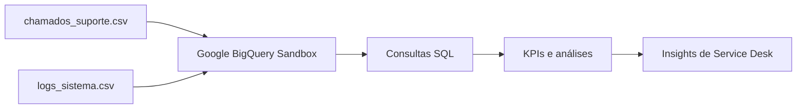

# Análise de Chamados de Suporte Técnico com Google BigQuery

Projeto de portfólio que simula uma operação de **Service Desk**, integrando dados fictícios de chamados e logs técnicos para analisar indicadores de atendimento, SLA, reincidência, satisfação e comportamento dos sistemas.

> **Observação:** todos os dados utilizados neste projeto são fictícios e foram criados exclusivamente para fins de estudo e portfólio.

## Objetivo

O projeto foi desenvolvido para praticar conceitos de **Big Data, armazenamento e análise de dados em nuvem**, aplicando-os a um cenário próximo de uma operação real de Suporte Técnico.

A proposta foi carregar e organizar diferentes fontes de dados no Google BigQuery, realizar consultas SQL, acompanhar indicadores de Service Desk, relacionar dados técnicos com a experiência do usuário e identificar padrões que possam apoiar ações de melhoria contínua.

## Arquitetura do projeto



Nesta implementação, os arquivos CSV foram carregados diretamente no **BigQuery Sandbox**, permitindo desenvolver o projeto sem ativar faturamento no Google Cloud.

## Fontes de dados

### Chamados de suporte

A base `chamados_suporte.csv` contém **200 chamados fictícios**, com informações sobre categoria, prioridade, canal, nível de atendimento, status, SLA, tempo de resolução, reincidência e CSAT.

### Logs técnicos

A base `logs_sistema.csv` contém **300 eventos fictícios**, incluindo sistema, severidade, tipo de evento, mensagem, origem, status e vínculo com chamados. Parte dos logs possui um `id_chamado`, permitindo relacionar as duas fontes com `JOIN`.

## Tecnologias utilizadas

- **Google BigQuery Sandbox**
- **SQL**
- **CSV**
- **GitHub**
- Conceitos de **Service Desk / ITSM**

## Principais análises

- volume de chamados por categoria e prioridade;
- cumprimento de SLA por prioridade;
- tempo médio de resolução;
- reincidência por categoria;
- relação entre SLA e CSAT;
- impacto da reincidência na satisfação;
- distribuição dos logs por severidade;
- erros e eventos críticos por sistema;
- integração entre logs e chamados com `JOIN`;
- resumo executivo de KPIs.

As consultas estão disponíveis em [`sql/analises_suporte_bigquery.sql`](sql/analises_suporte_bigquery.sql).

## Principais indicadores

| Indicador | Resultado |
|---|---:|
| Total de chamados | 200 |
| Chamados finalizados | 161 |
| Cumprimento de SLA | 78,3% |
| Tempo médio de resolução | 8,0 h |
| CSAT médio | 4,09 / 5 |
| Reincidência | 12% |


## Insights encontrados

### 1. Distribuição dos chamados

A categoria **Banco de Dados** concentrou o maior volume de chamados, com **48 ocorrências (24%)**, embora a distribuição entre as categorias tenha permanecido relativamente equilibrada.


### 2. SLA e satisfação do usuário

Chamados atendidos **dentro do SLA** apresentaram CSAT médio de **4,26**, enquanto os atendidos **fora do SLA** tiveram média de **3,49**. Nesta base simulada, o resultado mostra associação entre cumprimento de prazo e maior satisfação do usuário.


### 3. Reincidência

A categoria **Sistema** apresentou a maior taxa de reincidência, com **22,5%**, indicando um ponto que mereceria investigação de causa raiz em uma operação real.


### 4. Integração entre logs e chamados

Foi realizado um `JOIN` entre os eventos técnicos e os chamados de suporte. O **Banco Oracle** concentrou o maior número de logs vinculados, enquanto o **Servidor de Impressão** apresentou o maior tempo médio de resolução entre os sistemas analisados.


## Estrutura do repositório

```text
data-lake-suporte-tecnico/
├── README.md
├── dados/
│   ├── chamados_suporte.csv
│   └── logs_sistema.csv
├── sql/
│   └── analises_suporte_bigquery.sql
└── imagens/
    ├── 01_chamados_por_categoria.png
    ├── 02_kpis_gerais.png
    ├── 03_sla_vs_csat.png
    ├── 04_reincidencia_por_categoria.png
    └── 05_join_logs_chamados.png
```

## Como reproduzir

1. Criar um projeto no Google Cloud e acessar o **BigQuery Sandbox**.
2. Criar um dataset.
3. Fazer upload dos dois arquivos CSV disponíveis em `dados/`.
4. Criar as tabelas `chamados_suporte` e `logs_sistema`.
5. Executar as consultas disponíveis em `sql/analises_suporte_bigquery.sql`.
6. Analisar os resultados e indicadores.

## Competências praticadas

- SQL aplicado à análise de dados;
- agregações com `COUNT`, `AVG` e `COUNTIF`;
- tratamento seguro de divisões com `SAFE_DIVIDE`;
- integração de fontes com `JOIN`;
- análise de SLA, CSAT e reincidência;
- interpretação de indicadores de Service Desk;
- documentação técnica;
- análise de dados em ambiente cloud.

---

**Autora:** Jéssica Fernanda Gaudencio